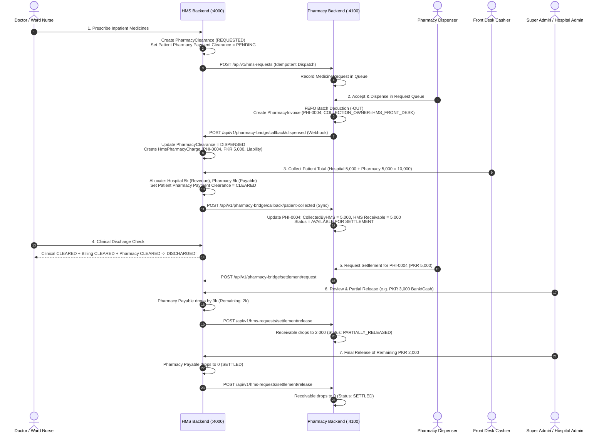

# HMS ↔ Standalone Pharmacy Software: Final Integration Specification & Implementation Roadmap

> **Document Version:** 2.0 (FINAL BUSINESS WORKFLOW)  
> **Target Systems:**  
> - **Hospital Management System (HMS):** `ch-sharif-and-saeed-hospital---hms` (Frontend :3000) & `hms-backend` (API :4000)  
> - **Standalone Pharmacy Software:** `pharmacy-software/frontend` (:5180) & `pharmacy-software/backend` (API :4100)  
> **Source of Truth:** Master Specification v6.3, `HMS_V7.2_NEW_REQUIREMENTS.md`, and Final Business Rule (Dual Independent Clearance & Institutional Settlement).

---

## 1. Core Business Rules & Architectural Principles

### 1.1 Two Distinct Pharmacy Scenarios
1. **A) Direct Pharmacy / Retail POS Sale:**
   - Walk-in customer directly purchases medicine at the Pharmacy counter.
   - Flow: Pharmacy POS → Invoice created (`channel: RETAIL`) → Pharmacy Cashier collects Cash/Card/Online → Cashier Shift/Drawer Balance Sheet updates immediately.
   - **Crucial Rule:** Direct retail flow is self-contained within Pharmacy Software and is **completely untouched** by the HMS integration.
2. **B) HMS-Linked Admitted Patient:**
   - Medicine is prescribed/requested for an inpatient admitted in HMS.
   - Pharmacy fulfills and **DISPENSES** the medicine (FEFO batch deduction, stock movement `HMS_DISPENSE_OUT`, HMS-linked invoice `PHI-xxxx`).
   - **MANDATORY RULE:** Pharmacy **NEVER** collects money directly from the admitted patient.
   - The patient's complete bill (Hospital services + Pharmacy medicines) is collected **EXCLUSIVELY BY FRONT DESK / BILLING** in HMS.

---

### 1.2 End-to-End Billing & Settlement Example

```
Hospital Services Charge :  PKR 5,000
Pharmacy Dispensed Charge:  PKR 5,000 (PHI-0004)
-----------------------------------------------
Total Patient Due        : PKR 10,000
```

1. **Patient arrives at Front Desk / Billing:**
   - Front Desk collects **PKR 10,000** in full.
2. **Patient-Facing Financial Clearance (Immediate):**
   - Patient Hospital Outstanding = **0**
   - Patient Pharmacy Outstanding = **0**
   - **Patient Pharmacy Payment Clearance = CLEARED**
   - **Patient Hospital Billing Clearance = CLEARED**
   - Patient is immediately eligible for discharge (does NOT wait for hospital management to pay pharmacy).
3. **Internal Hospital ↔ Pharmacy Accounting (Deferred Settlement):**
   - Hospital portion = PKR 5,000 (Hospital Operating Revenue)
   - Pharmacy portion = PKR 5,000 (Hospital Clearing Liability / Pharmacy Payable)
   - In Pharmacy Software: **HMS Receivable = PKR 5,000** (Collected by HMS: 5,000, Received by Pharmacy: 0).
   - This PKR 5,000 is **NOT** automatic cash in pharmacy. It remains an inter-entity receivable/payable until management releases the settlement.

---

### 1.3 Strict Separation: Two Different Clearances

| Clearance Concept | Purpose | Governed By | Statuses | Impact on Patient Discharge |
| :--- | :--- | :--- | :--- | :--- |
| **A. Patient Pharmacy Payment Clearance** | Discharge Gate | Front Desk / Billing Collection | `PENDING`, `PARTIALLY_COLLECTED`, `COLLECTED_AT_FRONT_DESK`, `CLEARED` | **Blocks Discharge** until patient's pharmacy share is collected at Front Desk. |
| **B. HMS ↔ Pharmacy Internal Settlement** | Institutional Inter-entity settlement | Hospital Admin / Super Admin release to Pharmacy | `NOT_DUE`, `PENDING`, `REQUESTED`, `APPROVED`, `PARTIALLY_RELEASED`, `RELEASED`, `SETTLED`, `REJECTED` | **NEVER blocks discharge.** Strictly an internal financial transfer. |

---

### 1.4 Ownership & Actor Attribution

- **HMS Owns:** Patient, Admission, Ward/Bed, Doctor, Inpatient billing, Front Desk cash collection, Hospital Receipts, Patient discharge gates, Settlement approval/release.
- **Pharmacy Owns:** Medicine catalog, Batches, Expiry, FEFO stock, Dispensing execution, Stock ledger (-OUT), Pharmacy Invoices, Pharmacy Receivable ledger, Settlement requests.
- **Universal Audit Trail:** Every event records actual user:
  - `Requested By` (Doctor/Nurse in HMS)
  - `Dispensed By` (Dispenser in Pharmacy)
  - `Collected By` (Cashier in Front Desk)
  - `Settlement Requested By` (Pharmacy Manager)
  - `Settlement Approved By` & `Released By` (Super Admin/Admin in HMS)

---

## 2. Comprehensive System Architecture & Data Flow



---

## 3. Implementation Plan: 5-Step Roadmap

### STEP 1: Environment & Service-to-Service Bridge Authentication
- Set `PHARMACY_BACKEND_URL=http://localhost:4100/api/v1` and `INTERNAL_BRIDGE_SECRET` in `hms-backend/.env`.
- Set `HMS_BACKEND_URL=http://localhost:4000/api/v1` and `INTERNAL_BRIDGE_SECRET` in `pharmacy-software/backend/.env`.
- Implement `bridgeAuth` middleware in both backends verifying `x-bridge-token`.

### STEP 2: Pharmacy Medicine Catalog → HMS Live Proxy
- Wire HMS Backend route `GET /api/v1/pharmacy-bridge/medicines` to fetch directly from Pharmacy Backend `GET /api/v1/pharmacy/medicines`.
- Ensure HMS prescription UI displays live medicine names, strengths, packaging, and current unit sale rates with local fallback caching.

### STEP 3: HMS Medicine Request → Pharmacy Hospital Request Queue
- In HMS Admission (`createPharmacyRequest` / `authorizeHighCostMedicine`), when request is authorized:
  - Call Pharmacy Backend: `POST /api/v1/hms-requests`.
  - Transmit `externalAdmissionRef`, `externalRequestRef` (idempotency key), `patientNameSnapshot`, `urgency`, `requestedByExternal`, and line items.
- Pharmacy records `MedicineRequest` (status: `REQUESTED`), visible live in `HmsRequestQueuePage.tsx`.

### STEP 4: Pharmacy FEFO Dispensing & Charge Callback to HMS Patient Billing
- Pharmacy staff clicks **"Accept & Dispense"** (or Partial):
  - FEFO batch deduction, `StockLedgerEntry` movement `HMS_DISPENSE_OUT`.
  - Generate `PharmacyInvoice` (`channel: HMS_LINKED`, `collectionOwner: HMS_FRONT_DESK`, `outstanding: 0` for patient counter).
- Webhook Callback from Pharmacy ➡️ HMS:
  - `POST /api/v1/pharmacy-bridge/callback/dispensed`
  - HMS records `HmsPharmacyCharge`:
    - Links to admission and `PharmacyClearance`.
    - Stores `pharmacyInvoiceNumber`, `subtotal`, `taxTotal`, `totalAmount`, `dispensedLines`.
    - Creates a Pharmacy charge component on the patient's admission bill (tagged as `PHARMACY_PAYABLE_LIABILITY`, not hospital operating revenue).
    - Status: `patientPaymentStatus = PENDING`.

### STEP 5: Front Desk Collection, Dual Clearances & Inter-Entity Settlement
1. **Front Desk Patient Payment:**
   - Front Desk cashier collects patient bill.
   - Payment is allocated between Hospital Services and Pharmacy Charges.
   - When patient pays the pharmacy portion:
     - `HmsPharmacyCharge.patientPaid` updates, `patientPaymentStatus = CLEARED`.
     - `DualDischargeClearance(PHARMACY)` flips to `CLEARED` (Patient is immediately eligible for discharge!).
     - Hospital records `PharmacyPayable` liability of PKR 5,000.
     - Webhook fires to Pharmacy: `POST /api/v1/hms-requests/callback/patient-collected` → Pharmacy sets `hmsReceivable = 5,000` (Status: `AVAILABLE_FOR_SETTLEMENT`).
2. **Pharmacy Settlement Request:**
   - Pharmacy Management opens **HMS Receivables & Settlements** screen.
   - Clicks **"Request Settlement"** for collected invoices.
   - Dispatches `POST /api/v1/pharmacy-bridge/settlement/request` to HMS.
3. **HMS Admin/Super Admin Release:**
   - Super Admin/Admin opens **Pharmacy Settlements** in HMS.
   - Can release in Full or Partial (e.g. PKR 3,000 of 5,000).
   - Decreases HMS Pharmacy Payable.
   - Webhook notifies Pharmacy: `POST /api/v1/hms-requests/settlement/release`.
   - Pharmacy decreases `hmsReceivable` by the released amount.
   - When remaining receivable hits 0: Status becomes `SETTLED`.

---

## 4. Database Schema Impact & Model Additions

### In `hms-backend/prisma/schema.prisma`:
1. **`HmsPharmacyCharge` (New Model):**
   - Tracks each pharmacy invoice dispensed for an admission.
   - Fields: `id`, `admissionRecordId`, `pharmacyClearanceId`, `pharmacyInvoiceNumber`, `subtotal`, `taxTotal`, `totalAmount`, `patientPaid`, `patientOutstanding`, `patientPaymentStatus` (`PENDING`, `PARTIALLY_COLLECTED`, `CLEARED`), `settlementStatus` (`NOT_DUE`, `PENDING`, `REQUESTED`, `PARTIALLY_RELEASED`, `SETTLED`), `settledAmount`, `itemsJson`, `collectedById`, `collectedAt`.
2. **`HmsPharmacySettlement` (New Model):**
   - Tracks management release transactions to Pharmacy.
   - Fields: `id`, `settlementNumber`, `pharmacyChargeId`, `pharmacyInvoiceNumber`, `requestedAmount`, `approvedAmount`, `releasedAmount`, `remainingAmount`, `status`, `paymentMethod`, `paymentReference`, `requestedByExternal`, `requestedAt`, `releasedById`, `releasedAt`, `remarks`.

### In `pharmacy-software/backend/prisma/schema.prisma`:
1. **Enhancements to `PharmacyInvoice`:**
   - `collectionOwner`: `CollectionOwner` (`PHARMACY_RETAIL` | `HMS_FRONT_DESK`).
   - `hmsCollectedAmount`: Decimal @default(0).
   - `hmsSettledAmount`: Decimal @default(0).
   - `hmsReceivable`: Decimal @default(0).
   - `internalSettlementStatus`: `InternalSettlementStatus` (`NOT_DUE`, `PENDING`, `REQUESTED`, `PARTIALLY_RELEASED`, `SETTLED`).
2. **`HmsReceivableSettlement` (New Model):**
   - Tracks settlement request and receipts on the Pharmacy side.
   - Fields: `id`, `settlementNumber`, `invoiceId`, `externalAdmissionRef`, `patientNameSnapshot`, `invoiceNumber`, `invoiceTotal`, `hmsCollected`, `amountRequested`, `amountReleased`, `remainingReceivable`, `status`, `requestedById`, `requestedAt`, `releasedAt`, `paymentMethod`, `paymentReference`.

---

## 5. End-to-End Verification Scenario

| Step | Action | Hospital Due | Pharmacy Due | Patient Clearances | Pharmacy Receivable | Internal Settlement |
| :--- | :--- | :--- | :--- | :--- | :--- | :--- |
| **Initial** | Doctor requests & Pharmacy dispenses (Hospital 5k, Pharmacy 5k) | PKR 5,000 | PKR 5,000 | 🟡 PENDING | PKR 0 (Not yet collected) | NOT_DUE |
| **Collection**| Front Desk collects full PKR 10,000 from patient | **PKR 0** | **PKR 0** | 🟢 **CLEARED** (Discharge Unlocked!) | **PKR 5,000** | PENDING |
| **Settlement Req**| Pharmacy requests settlement for PHI-0004 | PKR 0 | PKR 0 | 🟢 CLEARED | PKR 5,000 | REQUESTED |
| **Partial Release**| HMS Admin releases PKR 3,000 (Cash/Bank) | PKR 0 | PKR 0 | 🟢 CLEARED | **PKR 2,000** | PARTIALLY_RELEASED |
| **Full Release** | HMS Admin releases remaining PKR 2,000 | PKR 0 | PKR 0 | 🟢 CLEARED | **PKR 0** | **SETTLED** |
